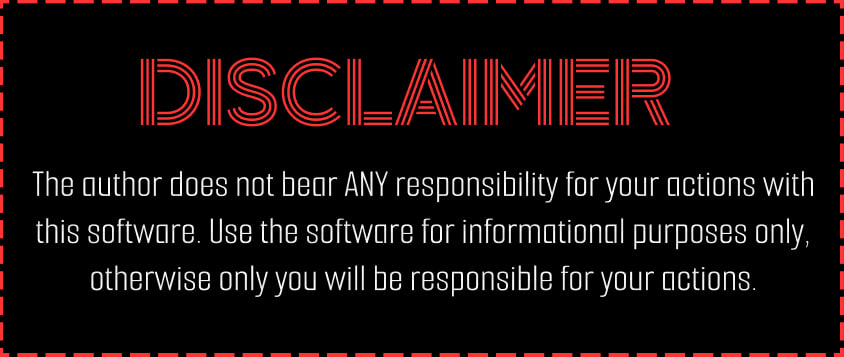

<div align="center">
<p>
  
  
  
  
</p>
</div>
<div align="center">
<p>
  
  
</p>
</div>

## Basic usage

### Installation
The software requires the latest version of Python, Selenium(geckodriver, undetected-chromedriver)
```
pip install -r requirements.txt
```

### `python xpsms.py --help`
```
Provide XPSMS with user data

options:
  -h, --help           show this help message and exit
  -p, --prefix PREFIX  Target's country code. Must start with +.
  -a, --aim AIM        Target's phone number. Must start with +.
  -c, --call           Set up flag if calls are required.
  -s, --sms            Set up flag if SMS are required.
  -u, --undetected     Runs a modified Chromium engine instead of default Geckodriver.
```

> [!IMPORTANT]  
> UC2 driver is better for requesting calls. However, Geckodriver is more focused on sending SMS messages.

### Examples for one Target
> [!WARNING]  
> <b>All automatic requests are not proxied.</b> Accordingly, it is recommended to have a new "clean" IP address for each new session, otherwise the service will be able to detect an automatic request.

```python
python xpsms.py -p +7 -a +77777777777 --call --undetected
```
```python
python xpsms.py -p +7 -a +77777777777 --call --sms --undetected
```
```python
python xpsms.py -p +7 -a +77777777777 --sms
```
